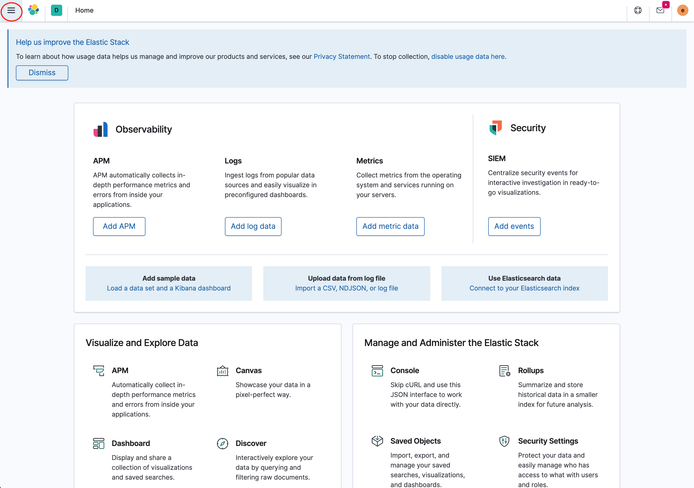
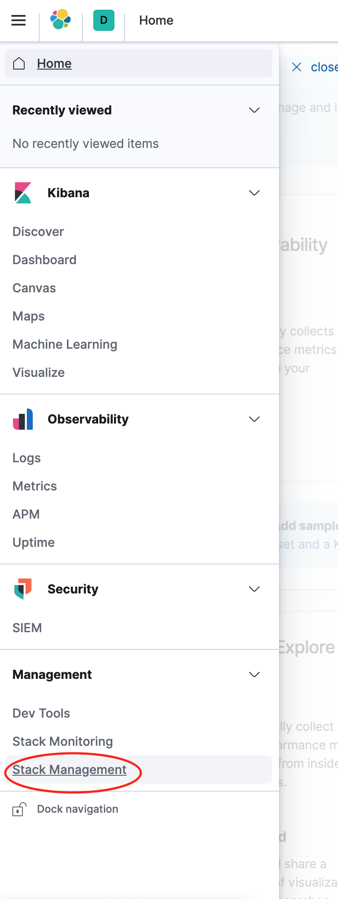
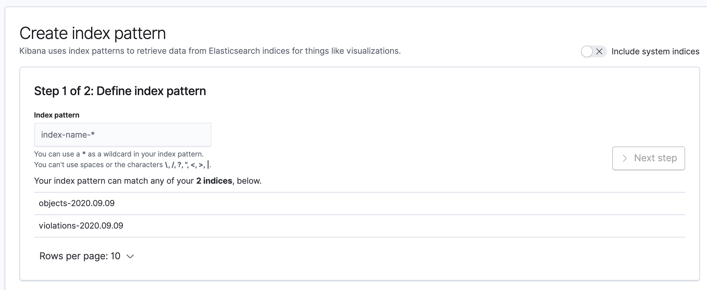
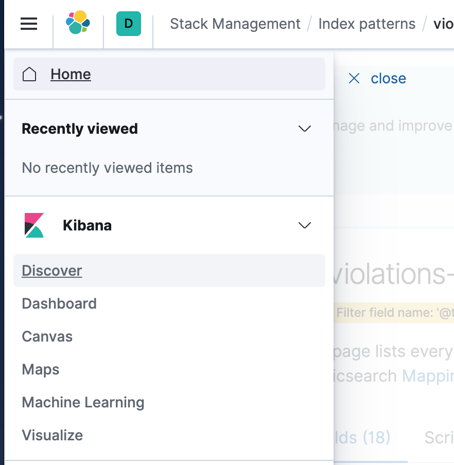
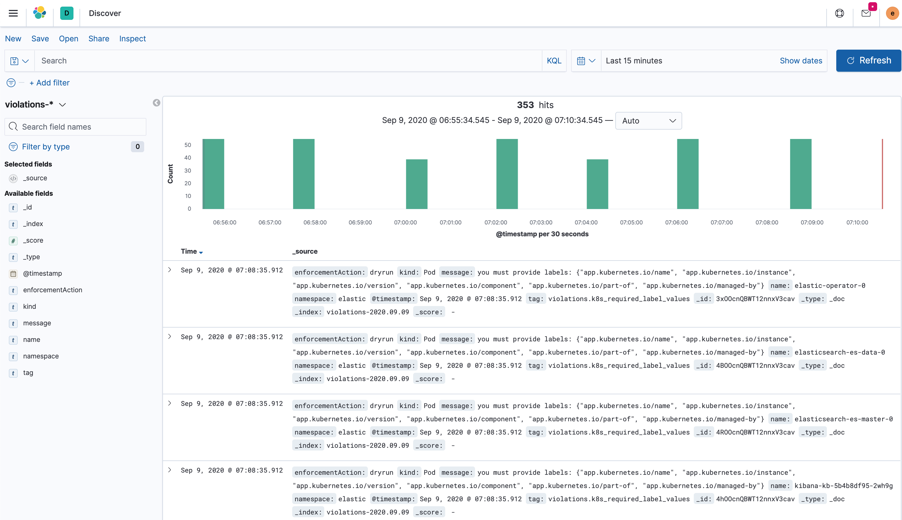
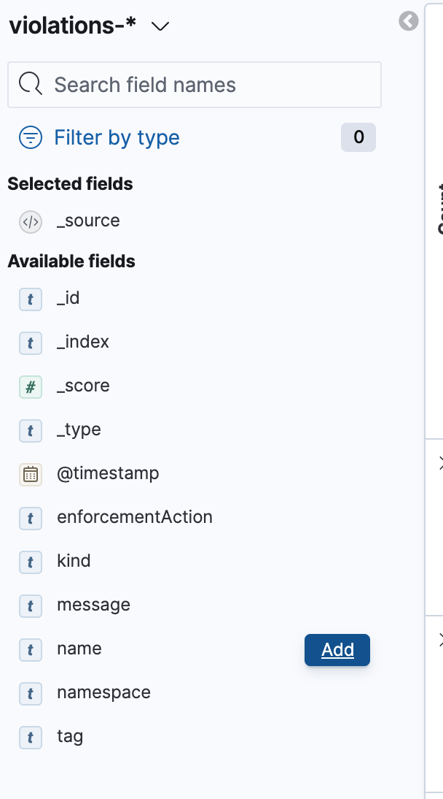
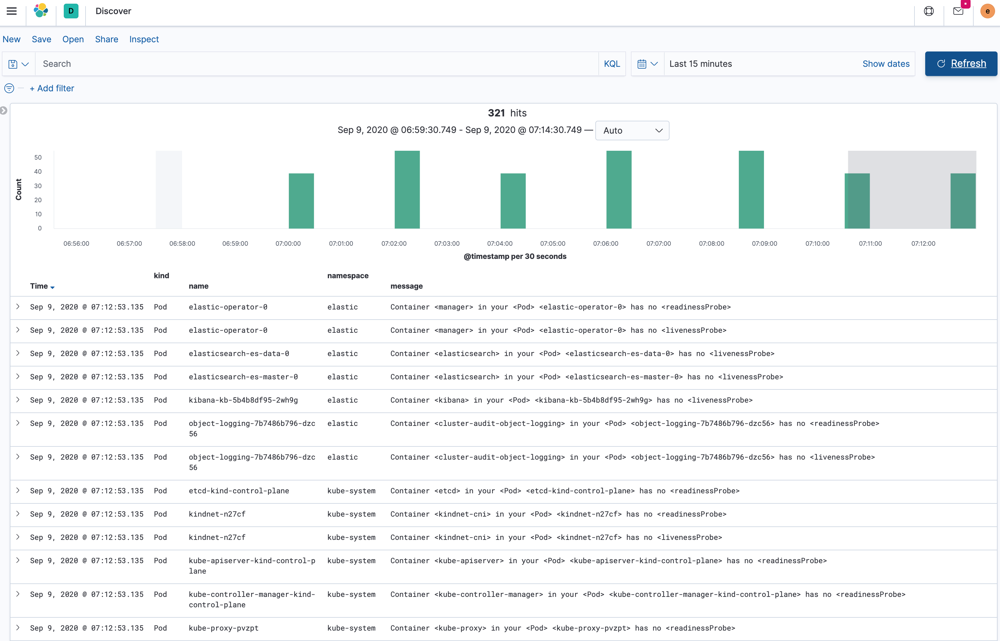

# Setting up Kibana

Upon logging into Kibana for the first time, some initial setup needs to occur to allow Kibana to correctly search the Elastic cluster.  Click the three bars on the top left of the screen:

Then select Stack Management:

Select Index Patterns under the Kibana section and then use Create Index Pattern on the right to create two different index patterns

The first index pattern will have an index name `violations-*` and will contain violiation events for the OPA Gatekeeper policies installed by the Cluster Auditor.  Click `Next` and select `@timestamp` as the Time Filter.   Press the Create Index Pattern button to create the Objects Index pattern.  This index will be the default search index since it was created first.

Repeat this for the index name `objects-*` with the same `@timestamp` Time Filter.  This Index Pattern will contain all the native Kubernetes objects that the Cluster Auditor watches: `Pods`, `Namespaces`, `Events`.

After selecting the three bars in the top left, click the `Discover` link under `Kibana`.

The loaded page should show a series of events:

To view the data in a table format, select the `Add` button that shows up when hovering over `kind`, `name`, `namespace` and `message`.

Makes the output look like:

