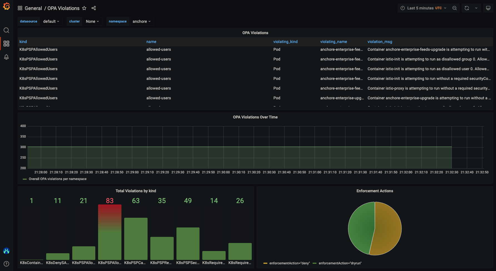

# Monitoring

The primary way to access/view data collected by Cluster Auditor is through its metrics.

# Prometheus

Cluster Auditor is automatically shipped with a `ServiceMonitor` with allows Prometheus to scrape its metrics port. These metrics can be viewed in Prometheus if desired via the following metrics names:
- `opa_scorecard_up`: Basic metrics that validate the monitor is functioning
- `opa_scorecard_constraint_information`: Provides details of all `Constraints` currently deployed in the cluster (name, kind, violations, and enforcement type)
- `opa_scorecard_constraint_violations`: Provides granular detail on all violations (the offending pod/ns, the constraint, enforcement type, and message)

# Grafana

The easiest way to view Cluster Auditor data is through the pre-configured Grafana Dashboard `OPA Violations`.

This dashboard displays (per namespace) all violations, with filtered graphs and charts based on violation type, time, and enforcement action. The image below provides a preview of what this dashboard looks like in an example cluster.

